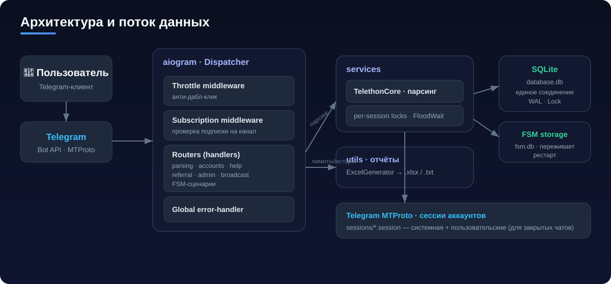

<p align="center">
  
</p>

<p align="center">
  
  
  
  
  
  
</p>

---

## 📖 О проекте

**NeuroScraper Pro** — асинхронный Telegram-бот для сбора целевой аудитории из
каналов и чатов. Собирает активных пользователей и комментаторов с гибкими
фильтрами по времени, поддерживает многоаккаунтность для закрытых групп и
генерирует детальные отчёты в Excel и TXT.

Проект построен на `aiogram 3` (бот) + `Telethon` (MTProto-парсинг) с акцентом
на **стабильность под нагрузкой**: единое соединение SQLite, сериализация доступа
к Telegram-сессиям, персистентный FSM и аккуратная обработка FloodWait.

> ⚠️ Используйте ответственно и в соответствии с [Terms of Service Telegram](https://telegram.org/tos).

---

## ✨ Возможности

| Категория | Что умеет |
|-----------|-----------|
| **Парсинг каналов** | Комментаторы последних постов · комментаторы конкретного поста |
| **Парсинг чатов** | Участники группы (список) · активные (по сообщениям) · «Мои чаты» по диалогам |
| **Фильтры** | День · неделя · месяц · 3 месяца · за всё время (до 200 постов) |
| **Доп. данные** | Парсинг bio · эвристическое определение пола · отметка premium |
| **Многоаккаунтность** | Системная сессия + пользовательские аккаунты (2FA) для закрытых чатов |
| **Отчёты** | Excel (Users / Admins / Raw / Statistics) + TXT-список `@username` |
| **Монетизация** | Лимит бесплатных парсингов · премиум · реферальная программа |
| **Админка** | Премиум, сброс лимитов, статистика, рассылки, управление админами |

---

## 🏗 Архитектура

<p align="center">
  
</p>

Поток запроса: **пользователь → Telegram → middleware (throttle, подписка) →
роутеры/FSM → services (Telethon) → SQLite / FSM-storage → Excel-отчёты**.

---

## 🚀 Быстрый старт

```bash
# 1. Клонировать
git clone https://github.com/pavelvladimirovich258614-sys/neuro-scraper-pro.git
cd neuro-scraper-pro

# 2. Виртуальное окружение
python -m venv .venv
# Windows:
.venv\Scripts\activate
# Linux/Mac:
source .venv/bin/activate

# 3. Зависимости
pip install -r requirements.txt

# 4. Настроить окружение
cp .env.example .env   # затем заполнить значения

# 5. (опционально) Создать системную сессию для публичного парсинга
python auth.py

# 6. Запуск
python main.py
```

### Переменные окружения (`.env`)

| Переменная | Назначение |
|------------|-----------|
| `BOT_TOKEN` | Токен от [@BotFather](https://t.me/BotFather) |
| `ADMIN_ID` | Ваш Telegram ID ([@userinfobot](https://t.me/userinfobot)) |
| `API_ID`, `API_HASH` | С [my.telegram.org](https://my.telegram.org) → API development tools |
| `SUBSCRIPTION_CHANNEL_ID`, `SUBSCRIPTION_CHANNEL_LINK` | Обязательный канал для подписки |
| `SUPPORT_LINK` | Ссылка на поддержку |
| `DATABASE_PATH`, `FSM_DB_PATH`, `SESSIONS_DIR` | Пути хранения (есть значения по умолчанию) |

---

## 🧪 Тесты

```bash
pip install -r requirements-dev.txt
pytest -q          # 57 тестов: БД, конкурентность, парсер ссылок, валидация, throttle
```

Тесты покрывают критичный слой: лимиты и рефералы, **конкурентную запись в БД**
(подтверждает отсутствие `database is locked`), разбор ссылок и анти-дабл-клик.

---

## 🗂 Структура проекта

```
neuro-scraper-pro/
├── main.py                     # Точка входа: Bot, Dispatcher, роутеры, middleware
├── config.py                   # Конфигурация и переменные окружения
├── database.py                 # SQLite: единое соединение (WAL + Lock)
├── keyboards.py                # Инлайн-клавиатуры
├── auth.py                     # Создание системной Telethon-сессии
├── handlers/                   # Роутеры
│   ├── user_handlers.py        #   парсинг, аккаунты, подписка
│   ├── admin_handlers.py       #   админка, рассылки
│   ├── help.py                 #   справка, лимит
│   └── referral.py             #   реферальная программа
├── middlewares/
│   ├── subscription_middleware.py   # проверка подписки (единая is_user_subscribed)
│   └── throttle_middleware.py       # анти-дабл-клик
├── services/
│   ├── telethon_core.py        # Ядро парсинга (per-session locks, FloodWait)
│   └── parsing_service.py      # Сервисный слой / валидация
├── storage/
│   └── sqlite_storage.py       # Персистентный FSM (переживает рестарт)
├── utils/
│   ├── excel_generator.py      # Excel + TXT отчёты
│   └── link_parser.py          # Чистый разбор ссылок (t.me/..., t.me/c/...)
├── tests/                      # pytest (57 тестов)
├── requirements.txt
└── requirements-dev.txt
```

---

## 🤖 Команды

| Команда | Действие |
|---------|----------|
| `/start` | Главное меню (поддержка реферальных ссылок) |
| `/help` | Справка |
| `/id` | Узнать свой Telegram ID |
| `/cancel` | Выйти из любого сценария |
| `/admin` | Админ-панель (только для администраторов) |

---

## 🔒 Надёжность и безопасность

- **Стабильность:** единое соединение SQLite (WAL+Lock), сериализация Telegram-сессий, персистентный FSM, graceful shutdown, глобальный error-handler.
- **Анти-детект:** случайные задержки, батчинг, корректная обработка `FloodWaitError`, имитация устройства.
- **Конфиденциальность:** сессии хранятся локально (`sessions/`), `ADMIN_ID` исключён из отчётов, пароли 2FA удаляются из чата, секреты — только в `.env`.

---

## 📄 Лицензия

Проект создан в образовательных целях. Используйте ответственно и в соответствии с ToS Telegram.

<p align="center"><sub>NeuroScraper Pro · async Telegram audience parser</sub></p>
